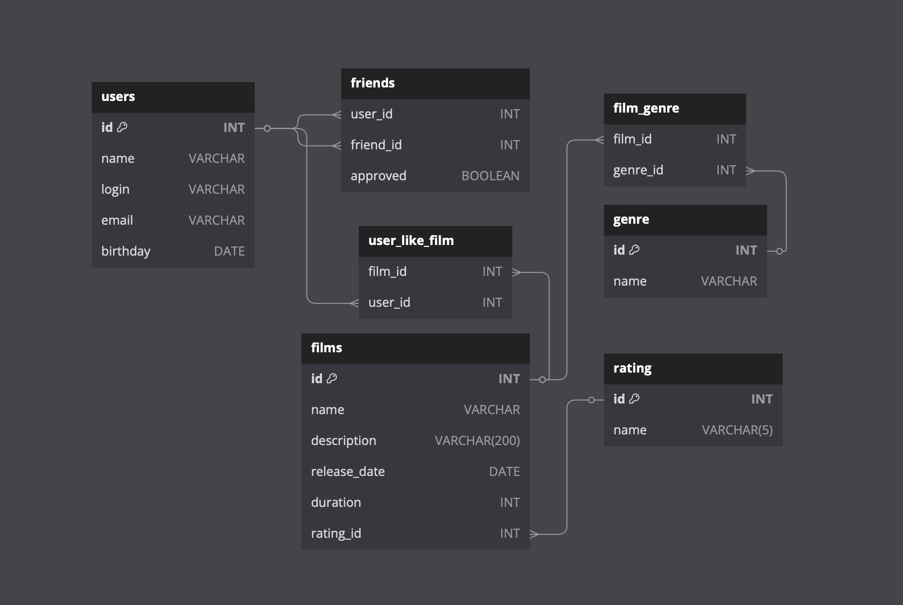

# java-filmorate

## Tables description

- ### users - Stores information about users

| Column     | Type    | Constraint                                         | Description                                          |
|------------|---------|----------------------------------------------------|------------------------------------------------------|
| `id`       | INT     | Primary key                                        | Unique identifier for each user                      |
| `name`     | VARCHAR | If null or empty, must be equal to the login value | Full name                                            |
| `login`    | VARCHAR | Unique, not null and not empty                     | Login username for authentication                    |
| `email`    | VARCHAR | Unique, must adhere to a specific format           | Email used for user communication and authentication |
| `birthday` | DATE    | Date value cannot be in the future                 | Date of birth                                        |

&nbsp;

- ### Films - stores information about films

| Column         | Type         | Constraint                            | Description          |
|----------------|--------------|---------------------------------------|----------------------|
| `id`           | INT          | Primary key                           | Unique identifier    |
| `name`         | VARCHAR      | Not null and not empty                | Name of the film     |
| `description`  | VARCHAR(200) | A maximum length is of 200 characters | Description          |
| `release_date` | DATE         | Must be after December 28, 1985       | Release date         |
| `duration`     | INT          | Must be a positive value              | Duration of the film |
| `rating_id`    | INT          | Foreign key references rating table   | Rating identifier    |

&nbsp;

- ### Genre - catalog of film genres

| Column | Type    | Constraint  | Description                      |
|--------|---------|-------------|----------------------------------|
| `id`   | INT     | Primary key | Unique identifier for each genre |
| `name` | VARCHAR | -           | Name of the genre                |

&nbsp;

- ### Rating - catalog of film rating

| Column | Type       | Constraint  | Description                       |
|--------|------------|-------------|-----------------------------------|
| `id`   | INT        | Primary key | Unique identifier for each rating |
| `name` | VARCHAR(5) | -           | Name of the rating                |

&nbsp;

- ### Friends - manages friendships between users

| Column      | Type    | Constraint | Description                                       |
|-------------|---------|------------|---------------------------------------------------|
| `user_id`   | INT     | -          | User ID of the user initiating the friend request |
| `friend_id` | INT     | -          | User ID of the friend being added                 |
| `approved`  | BOOLEAN | -          | Approval status of the friendship                 |

&nbsp;

- ### user_like_film - tracks user interactions by capturing likes for films.

| Column    | Type | Constraint | Description                       |
|-----------|------|------------|-----------------------------------|
| `film_id` | INT  | -          | ID of the film being liked        |
| `user_id` | INT  | -          | ID of the user who likes the film |

&nbsp;

- ### film_genre - stores the associations between films and their corresponding genres

| Column     | Type | Constraint | Description     |
|------------|------|------------|-----------------|
| `film_id`  | INT  | -          | ID of the film  |
| `genre_id` | INT  | -          | ID of the genre |

&nbsp;

---